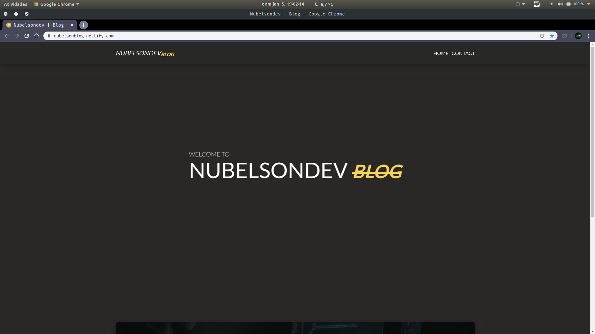

# My Personal Blog (w/ Gatsby.js)



This is my Personal Blog made with [Gatsby.js](https://www.gatsbyjs.org/) for the # 100DaysOfCode Challenge.

This project contains uses of the best features that gatsby offers us such as Dynamic page generation using CMSs as a data source.

## Getting Started

These instructions will get you a copy of the project up and running on your local machine for development and testing purposes. Feel free to deploy if you want.

### Prerequisites

You will need a CMS API Key ([Contentful](https://www.contentful.com/), [Netflify CMS](https://www.netlifycms.org/) ...) to dynamically fetch the data and generate a page for each Post created in CMS.

### Installation

Clone the repository and run

```javascript
// With NPM
$ npm install
$ npm run start

// With Yarn
$ yarn install
$ yarn start
```

## Built With

-   [GatsbyJS](https://www.gatsbyjs.org/)
-   [ReactJS](https://reactjs.org/)
-   [Styled Components](https://www.styled-components.com/)

## Contributing

Please feel free to send pull request if you want to contribute!

## Authors

-Nubelson - _Development_ - [nubelsondev](https://github.com/nubelsondev)
